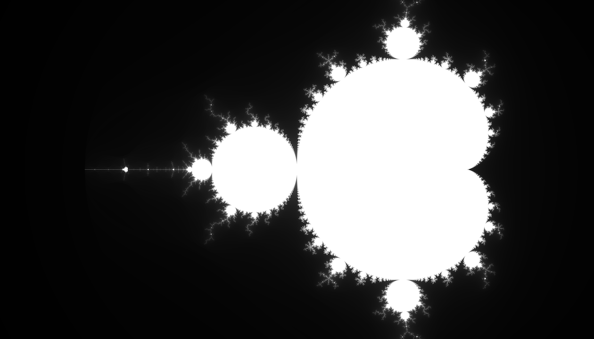
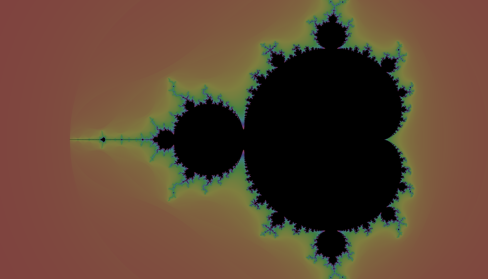

# Hello Mandelbrot

A playground for fractal-related shenanigans. Right now, it only has a simple
Python prototype that I've been using to play around with fractal generation.

## Python Prototype

Located in the `python-protoype` directory. A Python 2 Mandelbrot set generator.

It's quite a naive approach to generating the set, but lets me play around with
new ideas. It's quite slow since Python's GIL prevents efficient
parallelization.

### Sample output





### Usage

You probably want to set up and source a [Python 2.7 virtual environment](http://docs.python-guide.org/en/latest/dev/virtualenvs/) before running these steps.  

``` bash
cd python-protoype
# (run the following with sudo if you want to use your system Python)
pip install -r requirements.txt  
python mandelbrot.py --height 500 --nmax 80
```

## OpenCL implementation (in progress)

I'm taking my naive Python 2 implementation and reimplement it in OpenCL,
which will allow me to parallelize the problem. I'll likely then start
performing optimizations on this version.

### Dependencies
- clang
- libpng
- png++

I'm developing on OS X 10.11, targeting my mid-2015 MacBook Pro's AMD Radeon R9
M370X GPU.
